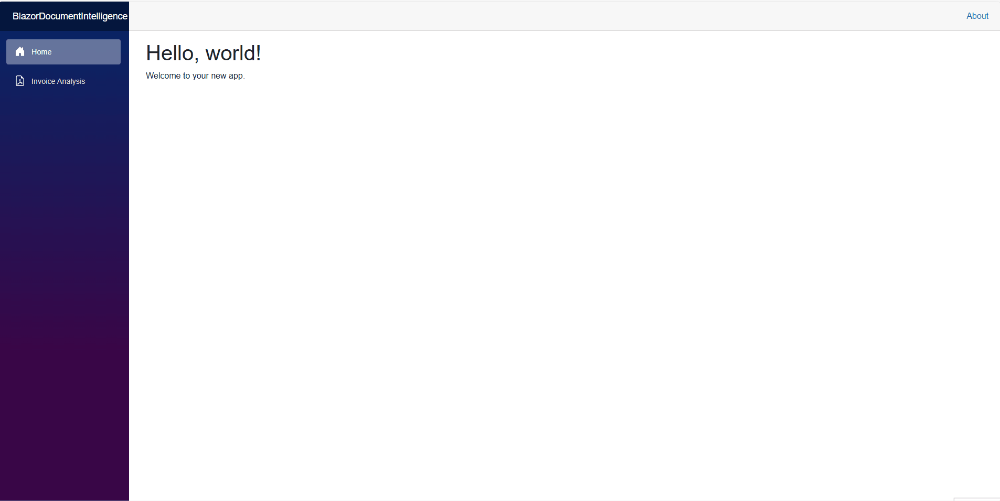

# Blazor Azure Document Intelligence

This project is an Optical Character Recognition (OCR) application built with Blazor WebAssembly and Azure Document Intelligence using the prebuilt-invoice model. 

## Key Features
- :floppy_disk: Uploading and saving PDF invoices to Azure Blob Storage
- :chart_with_upwards_trend: Analyzing invoices with Azure Document Intelligence prebuilt-invoice models
- :page_facing_up: Displaying the data retrieved from OCR analysis (vendor, customer, line items, totals and associated confidence score) in a user-friendly UI with Bootstrap

## Demo


## Prerequisites
To run this project, you will need:
- [.NET 8.0 SDK](https://dotnet.microsoft.com/download/dotnet/8.0)
- An [Azure account](https://azure.microsoft.com/)
- An Azure Blob Storage account and container
- An Azure Document Intelligence (formerly Form Recognizer) resource

## Running this Sample
1. Open the solution in Visual Studio or Visual Studio Code
2. Fill in your Endpoint and Key for Azure Document Intelligence in `appsettings.Development.json`

    ```json
    "AzureDocumentIntelligence": {
        "Endpoint": "{YOUR-AZUREDOCUMENTINTELLIGENCE-ENDPOINT}",
        "Key": "{YOUR-API-KEY}"
    }
    ```

3. Fill in your Connection String and Container Name for Azure Blob Storage in `appsettings.Development.json`
    ```json
    "AzureBlobStorage": {
        "ConnectionString": "{YOUR-BLOB-CONNECTION-STRING}",
        "Container": "{YOUR-CONTAINER-NAME}"
    }
    ```
4. Using Visual Studio
    - Press F5, or select the `Debug > Start Debugging` menu in Visual Studio

5. Using the .NET CLI from the terminal (e.g. from Visual Studio Code terminal)
    - `dotnet run --project BlazorDocumentIntelligence`

The app will be available at: http://localhost:5227

## Resources
- [Azure Document Intelligence Documentation](https://learn.microsoft.com/en-us/azure/ai-services/document-intelligence/?view=doc-intel-4.0.0)
- [Azure  Document Intelligence Invoice Model](https://learn.microsoft.com/en-us/azure/ai-services/document-intelligence/prebuilt/invoice?view=doc-intel-4.0.0)
- [C# SDK Azure Document Intelligence](https://learn.microsoft.com/en-us/azure/ai-services/document-intelligence/quickstarts/get-started-sdks-rest-api?view=doc-intel-4.0.0&preserve-view=true&pivots=programming-language-csharp)
- Invoice file used in demo is located inside `/invoice-sample` folder. It was created by using used the [Microsoft's templates gallery](https://create.microsoft.com/en-us/templates/invoices).